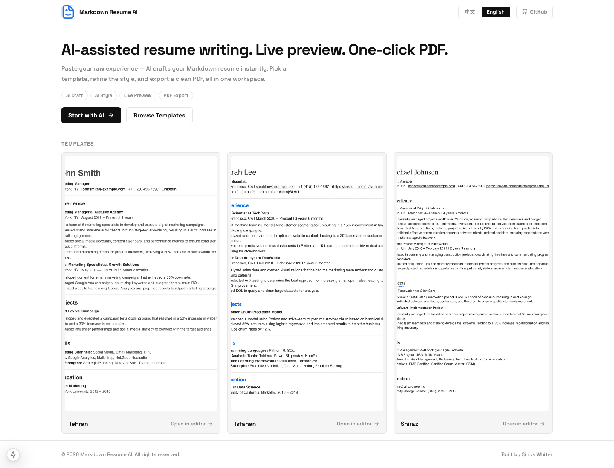
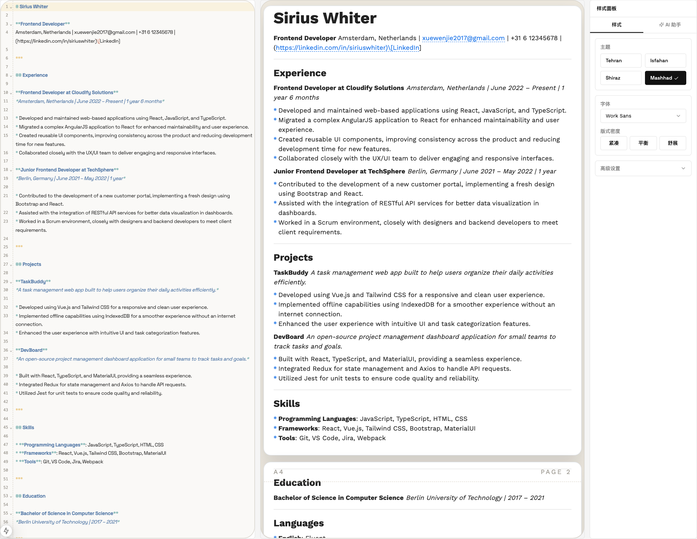

# Markdown Resume AI

<p align="center">
  <a href="README.md">English</a>
</p>

<p align="center">
  <a href="https://github.com/siriuswhiter/md-resume-ai/actions/workflows/ci.yml">
    
  </a>
  <a href="https://github.com/siriuswhiter/md-resume-ai/actions/workflows/deploy.yml">
    
  </a>
  
  
  
</p>

<p align="center">
  基于 Markdown 的 AI 简历编辑、实时预览、模板样式调整与 PDF 导出工具。
</p>

<p align="center">
  
</p>

---

## 功能亮点

| 功能 | 说明 |
|---|---|
| **Markdown 驱动编辑** | 简历内容结构清晰，便于维护、复用和版本管理 |
| **AI 辅助起草** | 将零散经历、项目笔记或职业信息整理为可编辑的 Markdown 草稿 |
| **实时纸张预览** | 左侧编辑，右侧同步查看最终简历版式 |
| **模板与样式控制** | 支持主题、字体、版式密度、颜色、间距和页边距调整 |
| **稳定 PDF 导出** | 使用服务端 Puppeteer 渲染，保证不同环境输出一致 |
| **灵活 LLM 接入** | 生产环境可用服务端 Key，本地试用可用 BYOK 模式 |

## 适用场景

- 从零散经历或项目记录中快速生成一份可投递简历。
- 用 Markdown 维护已有简历，减少排版和内容耦合。
- 针对不同岗位切换简历模板和展示风格。
- 自托管一个可选 AI 生成功能的简历编辑器。

## 技术栈

`Next.js 15` · `React 18` · `TypeScript` · `Tailwind CSS` · `MDXEditor` · `Playwright` · `Puppeteer` · `Docker` · `GitHub Actions`

---

## 快速开始

### 1. 安装依赖

```bash
npm install
```

### 2. 配置环境变量

```bash
cp .env.example .env
```

### 3. 启动开发服务

```bash
npm run dev
# 打开 http://localhost:3001/editor
```

---

## 环境变量

完整示例见 [`.env.example`](.env.example)。

| 变量名 | 默认值 | 说明 |
|---|---|---|
| `APP_PORT` | `3000` | Docker 对外暴露端口 |
| `LLM_DEBUG` | `false` | 开启 LLM 代理调试日志 |
| `NEXT_PUBLIC_USE_SERVER_LLM` | `false` | 启用后前端默认走服务端 LLM 路由 |
| `OPENAI_API_BASE` | `https://api.openai.com` | OpenAI 兼容 API Base URL |
| `OPENAI_API_KEY` | - | 服务端调用 LLM 所需密钥 |
| `PUPPETEER_EXECUTABLE_PATH` | `/usr/bin/chromium` | PDF 导出使用的 Chromium 路径 |

---

## AI 生成功能

编辑器内置 AI 助手，支持两种接入方式：

**服务端 Key 模式**，适合生产部署：

- 设置 `OPENAI_API_KEY`，可选设置 `OPENAI_API_BASE`。
- 浏览器请求通过 `/api/llm/chat` 转发，API Key 不会进入浏览器。

**BYOK 模式**，适合本地试用：

- 用户在编辑器中填写自己的 API Key。
- 配置仅保存在浏览器本地，不上传到服务端。

---

## Docker 部署

```bash
cp .env.example .env
docker compose --env-file .env up --build -d
# 打开 http://localhost:3000
```

容器说明：

- 已内置 Chromium，用于 PDF 导出。
- `NEXT_PUBLIC_USE_SERVER_LLM` 会在构建阶段和运行阶段同时注入。
- 健康检查端点：`http://127.0.0.1:3000/`

---

## 常用脚本

```bash
npm run dev                  # 启动本地开发服务，端口 3001
npm run build                # 构建生产版本
npm run start                # 启动生产服务
npm run lint                 # 运行 ESLint
npm run type-check           # 运行 TypeScript 类型检查
npm run test                 # 运行 Playwright E2E 测试
npm run capture:editor-shot  # 刷新编辑器工作区截图
```

---

## 产品截图

### 编辑器工作区

<p align="center">
  
</p>

### 简历模板

| Tehran | Isfahan | Shiraz |
|---|---|---|
|  |  |  |

<details>
<summary>更多模板截图</summary>

| Mashhad |
|---|
|  |

</details>

---

## CI/CD

项目基于 GitHub Actions 自动化：

- **CI**：在 `main` / `master` 的 push 和 PR 上执行 `lint`、`type-check` 和 `build`。
- **Deploy**：构建并推送 GHCR 镜像，再通过 SSH 和 `docker compose` 部署到目标服务器。

### 必需 Secrets

| Secret | 用途 |
|---|---|
| `SERVER_HOST` / `SERVER_PORT` / `SERVER_USER` | SSH 目标服务器信息 |
| `SERVER_APP_DIR` | 服务器部署目录 |
| `SERVER_SSH_KEY` | SSH 私钥 |
| `GHCR_USERNAME` / `GHCR_TOKEN` | GitHub Container Registry 凭据 |
| `OPENAI_API_KEY` | 启用服务端 LLM 模式时必需 |

### 可选 Variables

`APP_PORT` · `NEXT_PUBLIC_USE_SERVER_LLM` · `OPENAI_API_BASE` · `LLM_DEBUG`

### 目标服务器要求

- 已安装 Docker Engine 和 `docker compose`。
- 服务器可以访问 `ghcr.io`。
- `SERVER_APP_DIR` 对应部署目录可写。

---

## 目录结构

```text
.
├── .github/workflows/      # CI/CD 工作流
├── docs/                   # 项目文档
├── e2e/                    # Playwright E2E 测试
├── public/                 # 静态资源、模板和截图
├── src/app/                # Next.js App Router 页面与 API 路由
├── src/components/         # 页面与编辑器组件
├── src/hooks/              # 自定义 React Hooks
├── src/lib/                # 主题、字体、LLM 辅助函数与工具方法
└── src/styles/             # 全局、主题、博客和打印样式
```

---

## 贡献指南

欢迎提交 Issue 和 Pull Request。推荐流程：

1. Fork 仓库并创建功能分支。
2. 完成功能开发，并在需要时补充聚焦测试。
3. 运行 `npm run lint` 和 `npm run type-check`。
4. 提交 PR，说明变更内容和验证方式。

---

## License

MIT

## 联系方式

问题反馈或合作交流：[xuewenjie2017@gmail.com](mailto:xuewenjie2017@gmail.com)
